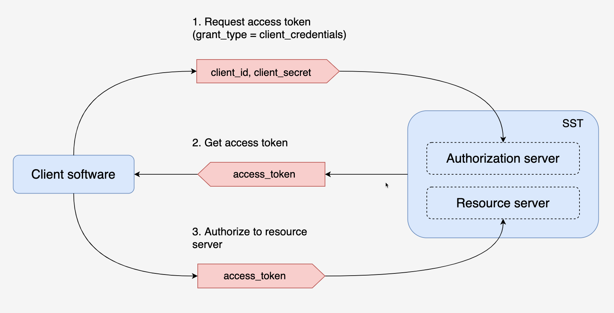

# SST API Guidelines

## 1. Preface
The Simpson Strong-Tie REST (SST) API Guidelines, as a design principle, encourages application developers to have resources accessible to them via a RESTful HTTP interface. To provide the smoothest possible experience for developers on platforms following the Simpson Strong-Tie REST API Guidelines, REST APIs SHOULD follow consistent design guidelines to make using them easy and intuitive.

This document establishes the guidelines Simpson Strong-Tie REST APIs SHOULD follow so RESTful interfaces are developed consistently.

## 2. Overview
### 2.1 Goals
A primary goal of these guidelines is to establish a cohesive look and feel for all Simpson Strong-Tie product and service. Additionally, we wish to instill an "API-only" development approach where all communications between separate modules must happen via APIs.
### 2.2 Non-Goals
"API" can mean a lot of things; in the context of this document, we're referring to service-level APIs that are exposed over a network. We are not discussing the look and feel of Java libraries, for example.

These guidelines also omit discussion regarding the means by which an application might implement a RESTful API. No assumptions are made regarding programming language or the use of application server frameworks.

## 3. Guidelines
### 3.1 Security
The Simpson Strong-tie API has been secured, we need to verify the client that is valid before using the Simpson Strong-tie system
### 3.2 Authentication and Authorization
#### 3.2.1 Authorization Grant
There are 4 grant types defined in the OAuth2 RFC 6749:

* Authorization Code
* Implicit
* Resource Owner Password Credentials
* Client Credentials

The Simpson Strong-tie system currently supports only the “Client Credentials” type when acting as authorization server where the resource owner client credentials (i.e. client_id and client_secret) can be used directly as an authorization grant to obtain an access token.

#### 3.2.2 Getting an access token from Simpson Strongtie system
After configuration is done, Simpson Strong-tie is ready to provide OAuth2 authorization but first you need to get the access token from it.

You can do this by the following POST request with multipart form-data in body:
> POST {baseURL}/oauth/token

| Parameter     | Value                                                      |
|---------------|------------------------------------------------------------|
| grant_type    | client_credentials                                         |
| client_id     | 12345 (unique id of the Client App configured)             |
| client_secret | ABCDE (unique secret code of the Client App configured)    |
JSON file that contains the access token and type of token will be returned:

>{  
"access_token": "eyJ4NXQjUzI1NiI6ImZYSkhReFpkTzlKWU1aaXFFaWQiO",  
"scope": "trust read write register",  
"allowed_services": "apigateway",  
"token_type": "Bearer",  
"expires_in": 86400  
}
### 3.3 Environment
* Staging Base URL: https://api-staging.strongtie.com/gws
* Production Base URL: https://api.strongtie.com/gws

### 3.4 Headers
Unless otherwise specified, all API endpoints expect request body data to be in JSON, and the response body data is returned as JSON.

The following HTTP request headers may be required, depending on the operation and endpoint being invoked:

| Header            |  Definition  | Example |
|-------------------|-------------|--------|
| **Authorization** | Required for all endpoints, except for POST /token. The access token. |   https://api-staging.strongtie.com/gws/api/Hangers |
| **Content-Type**  |   Required for POST and PUT requests. Defines the structure for the response   |     https://api.strongtie.com/gws/api/Hangers |

### 3.5 HTTP Verbs
* POST
* PUT
* GET
* DELETE
* PATCH
* HEAD
* OPTIONS
* SAFE AND NON-SAFE METHODS

### 3.6 Status Codes
SST uses a combination of [HTTP status codes](https://www.w3.org/Protocols/rfc2616/rfc2616-sec10.html) and custom error codes with a descriptive message in JSON-formatted Error objects to give you a more complete picture of what has happened with your request.

